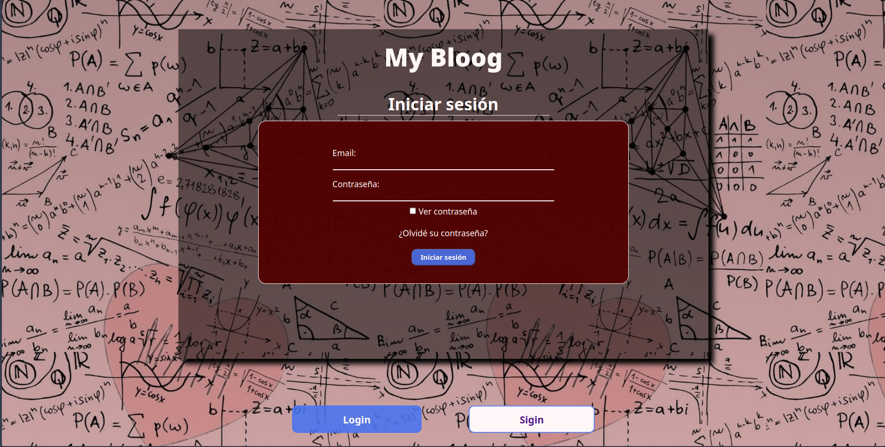
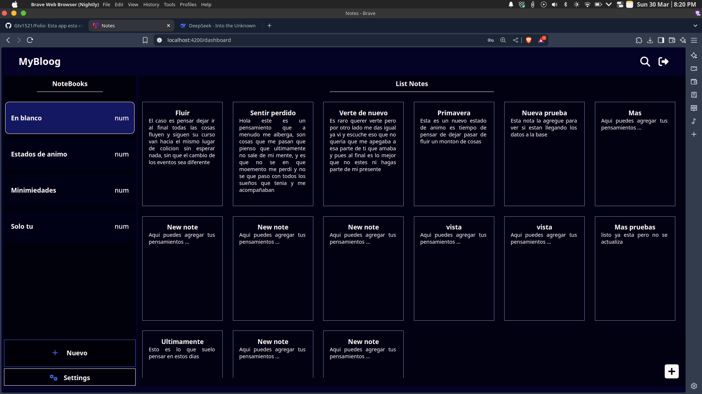

# MyBloog 📝  
**Tu espacio personal para ideas y notas**


Aplicación web para gestionar notas personales con sistema de autenticación y almacenamiento privado. ¡Tus ideas seguras y siempre accesibles!

  


## Características Principales 🔑
- **🔒 Acceso privado**: Registro/login con email y contraseña
- **📂 Notas personales**: Solo visibles para tu cuenta
- **🔄 Sincronización**: Datos guardados en tiempo real
- **📅 Organización**: Filtra por fecha o categorías
- **🌙 Modo oscuro**: Diseño adaptable a tu preferencia

## Tecnologías Clave 🛠️
- **Frontend**: Angular 19 + TypeScript
- **Autenticación**: Jwt .Net Core
- **Base de datos**: MongoDb Atlas
- **UI**: Angular Material + Sass
- **Deploy**: Vercel

## Donde Visitarla
Url: https://folio-8k2juteko-gtv1521s-projects.vercel.app/home

## Cómo Empezar 🚀
```bash
# 1. Clonar repositorio
git clone https://github.com/Gtv1521/BlogNotasFront.git

# 2. Instalar dependencias
npm install

# 3. Ejecutar aplicación
ng serve --open
